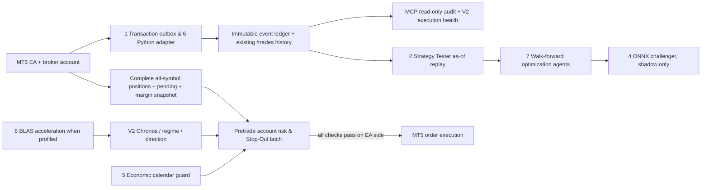

# Ramon V2 — eight-capability operational redesign (design + initial safety kernel)

**Status: architecture and isolated Python policy implemented; EA integration NOT live.**
This work branches from PR #69, keeping PR #70 out of scope.
The current EA remains the only authority capable of transmitting orders.

## Hard invariant: risk and broker authority precede AI



## Eight integrations and deployment gates

| # | Capability | Reworked V2 component | Deployment readiness |
|---|---|---|---|
| 1 | MCP | Local read-only diagnostics: trade statistics, missing events, spread / risk audit; prohibit order tools | Needs authenticated local MCP server and audited permissions |
| 2 | MT5 Strategy Tester | Deterministic as-of decision capture/replay; tester adapter must consume **only published-at or older** forecasts and actual execution costs | Native tester handshake and tick validation not implemented |
| 3 | OnTradeTransaction | MT5 EA emits position/order/deal events and explicit SL/TP changes with stable event IDs; idempotent local ingestion | Python event ledger exists in #69; **EA event producer outstanding** |
| 4 | ONNX | Versioned challenger feature schema, CPU-only inference, strict checksum and parity with Python | Model export, MQL5 inference and parity tests outstanding |
| 5 | Economic Calendar | Broker-native calendar adapter normalizes timestamps to UTC, high-impact USD event lock, merge with existing ForexFactory feed | Normalizer exists, native broker feed and fail-closed freshness gate outstanding |
| 6 | MT5 Python integration | Read-only account snapshot bridge; direct Python order APIs forbidden for V2 | Optional package detection only; terminal access not verified |
| 7 | Optimization Agents | Purged walk-forward and execution-cost scenarios, separate train/validation/holdout, immutable run manifests | Local shadow grid helper exists; agent execution and anti-overfit promotion outstanding |
| 8 | OpenBLAS | Profile bottleneck first, isolate NumPy BLAS thread counts to avoid CPU oversubscription on HP-Mini | Detection only, no benchmark or deployment config yet |

**Operational today (after user deployment)**: the #69 read-only
`v2-execution-health` monitor reading existing MT5 trade outcomes. This
redesign adds a *testable Python guard*, not an active trading guard yet.

## V2 execution safety requirements

1. EA receives **complete fresh account snapshot** including all open
   positions and pending orders, all symbols and all Magic numbers.
2. Risk-to-SL for each instrument must come from MT5 `OrderCalcProfit`
   with its symbol-specific tick value/contract specification. Open orders
   without SL or with unknown risk BLOCK new entries.
3. `PortfolioRiskAfter` includes existing exposure and candidate risk;
   multiple correlated positions are additive **even if directions differ**.
4. Direction and symbol concentration caps apply separately.
5. Check available margin using `OrderCheck` / `OrderCalcMargin`;
   reject based on post-trade margin **including all portfolio positions**.
6. A broker stop-out event latches the entry lock; explicit operator
   review/reset is required and should be auditable. **Never auto-reset
   on a new bar or container restart.**
7. The safety gate is enforced in the EA just before each `OrderSend`;
   the Python service is advisory and cannot override the EA's decision.
8. Existing position management and broker protective SL/TP continue even
   when new entries are disabled.
9. Risk units are **account units**, not USD. The Oct 8 examples showed
   `money_units_per_usd=100`, `max_executable_risk_usd=3`,
   two overlapping 0.39-lot SELL positions and aggregate risk 580.32 units.
   Treat account-wide margin and remaining external exposure as unknown
   until MT5 confirms them.
10. Count pending orders at their worst-case activation risk. Do not
    double-count attached SL or offset hedge risk without a verified
    broker-specific model.

## Code in this PR

- `src/ramon/v2_account_risk.py`: pure, fail-closed account preflight
  policy. Requires explicit completeness, freshness, stopout state,
  post-trade margin and SL validation. Never calls `order_send`.
- `tests/test_v2_account_risk.py`: regression for the pair of 8 October
  SELL risks and failure mode coverage.
- Existing #69 `v2_mt5_execution_health.py`: live data observability,
  a separate worker whose findings must not silently promote a model.

## Rollout and acceptance criteria

**Stage 0 — existing production unchanged:** run unit tests, compare
V2 decisions and risk metrics against baseline on captured snapshots.
No automatic exposure increase and no feature should change live orders.

**Stage 1 — add EA producer and preflight (future patch):** implement
native `OnTradeTransaction` emitter + persistence, complete
account risk/margin snapshot and immediate pre-`OrderSend` fail-closed
check in MQL5, with an input flag set to **DISABLED by default** until
terminal test. Handle outbox retries, idempotency and stop-out persistence.
This is the blocking deployment step.

**Stage 2 — deterministic tester:** historical event-sourced Replay
including real tick spread/slippage; validate against EA fills and
prevent training/evaluation leakage. Reproduce 8 October regression and
verify **second 0.39-lot SELL is rejected** under a 300-unit
account-level cap. Document deliberately chosen account risk cap, not
a guessed default.

**Stage 3 — plugins/model quality:** bind read-only MCP, Python bridge,
calendar and ONNX challenger. Parallel shadow monitoring, promotion only
with walk-forward and holdout results. Use OpenBLAS only when
benchmarks prove CPU wins without starving real-time services.

Acceptance: all tests pass, no unexplained position duplication, all
events reconciled, margin level floor respected, *operator opt-in* before
live enrollment, rollback path and auditable config snapshots.

## Tests

```bash
git fetch origin
git switch --track origin/feature/v2-eight-capability-redesign
PYTHONPATH=src uv run --extra dev pytest -q \
  tests/test_v2_account_risk.py \
  tests/test_v2_mt5_execution_health.py \
  tests/test_v3_mt5_integrations.py
```

The tests are committed but have **not** been executed on the user's MT5
terminal by the assistant. No Docker worker or EA binary needs restarting
to inspect this redesign.
